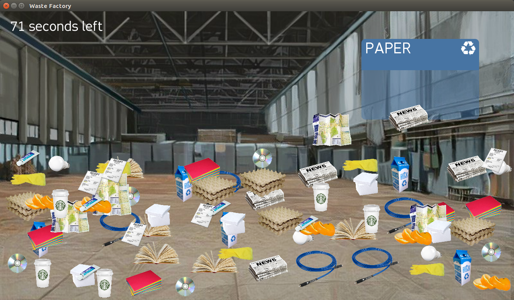

Waste Factory is a simple game which aims to help to understand
how to separate waste, made in to days for
[social hackathon](https://vk.com/socialhackspb).

* Idea by Kate Butomo
* Graphics by Ksenia Kalisheva

Using:
* [libgdx library](https://github.com/libgdx/libgdx)
* ['Fabrica' typeface](http://studiofaculty.com/archive/fabrica/)
* Angelo Badalamenti — Caitlin's Theme
* ['miu' iconset](https://www.iconfinder.com/iconsets/miu)
* ['ecosystem' sound](http://aparkov.ru/event/ekosistema/)
